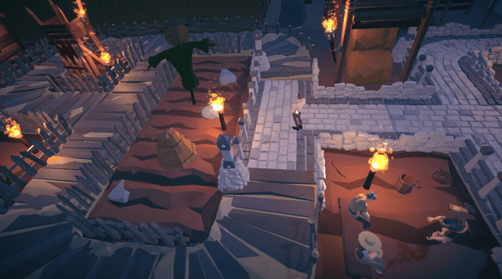

# Реализация кастомного поиска пути

Данный проект является тестовым заданием.

## Задание

Реализовать механику поиска пути на уровне

- Должна быть демо-сцена, где несколько юнитов двигаются по карте.
- Юниты не используют NavMesh, а обходят препятствия собственной логикой.
- Должны присутсвовать припятствия.
- Юнит выбирается кликом.
- При клике по земле - юнит идёт к выбранной точке.
- Юнит должно обходить препятствия и других юнитов.
- Движение — только плавное.

---

[Скачать билд с Google Drive](https://drive.google.com/drive/folders/1iG5QCTIGx216hH7Kqox4yWCkyP5rqnBr?usp=sharing)

---

## Что есть в игре:

### Небольшая стилизованная деревушка:
#### Дорога это путь по которому можно ходить все остальное остается в недосягаемости.

  

### Поиск пути:
#### Алгоритм для поиска пути используется А* путь строится только на торпинке

  

### Движения и анимации
#### В зависимости от повехронсти на которой стоит юнит его анимация и скорость будут изменяться.

  

---
### Также в игре есть конфиги настройки уровней, построение пути и визуализация в editor, юниты обходят друг друга и многое другое, но это уже в билде
