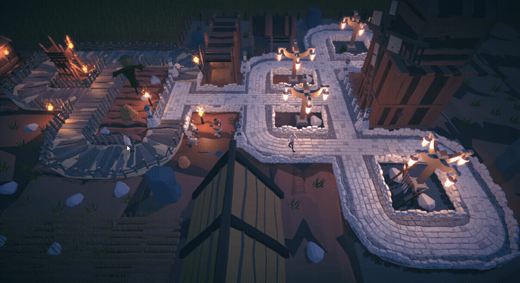

# Реализация кастомного поиска пути

Данный проект является тестовым заданием.

## Задание

Реализовать механику поиска пути на уровне

- Должна быть демо-сцена, где несколько юнитов двигаются по карте.
- Юниты не используют NavMesh, а обходят препятствия собственной логикой.
- Должны присутсвовать припятствия.
- Юнит выбирается кликом.
- При клике по земле - юнит идёт к выбранной точке.
- Юнит должно обходить препятствия и других юнитов.
- Движение — только плавное.

---

[Скачать билд с Google Drive](https://drive.google.com/drive/folders/1iG5QCTIGx216hH7Kqox4yWCkyP5rqnBr?usp=sharing)

---

## Что есть в игре:

### Небольшая стилизованная деревушка:
#### Дорога это путь по которому можно ходить все остальное остается в недосягаемости.

  

#### Смерть игрока от ловушеки (Нужно быть аккуратнее):

  

#### Сбор валюты игроком (А зачем?):

  

#### Время мести (Избиение врага):

  

#### Прыжок веры (Рискнули бы?):

  

#### Менее интрегующий вылет с карты с последующей смертью:

  

### Используемые технологии

  
  
  
  
  
  
  
  
  

